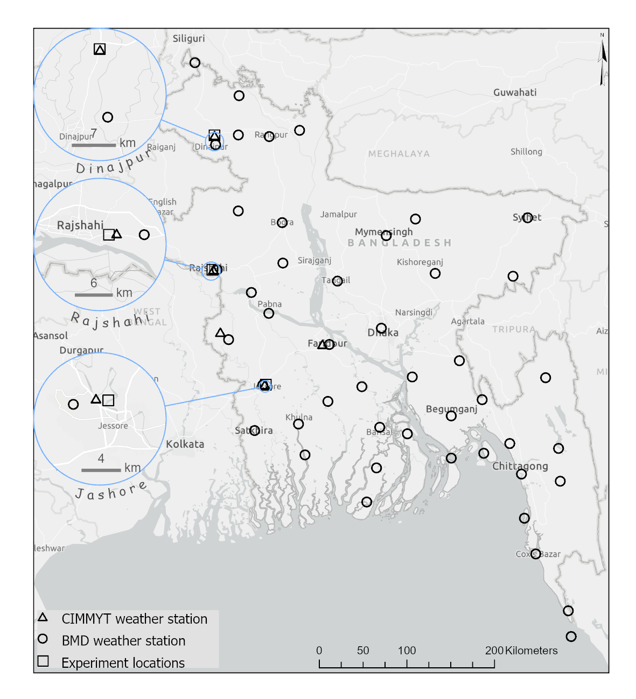

# Introduction

This document contains the supplementary material for the manuscript titled **"Mitigating the Impact of Wheat Blast on Wheat Production in Bangladesh: A Study on Sowing Dates and Varietal Selection"**. It includes additional analyses, datasets, and code used to generate the results presented in the main text.

```{r,echo=FALSE, message=FALSE, warning=FALSE}
knitr::opts_chunk$set(
  echo = FALSE,    # Show the code in the output
  message = FALSE, # Show messages generated by the code
  warning = FALSE  # Show warnings generated by the code
)

```

## Packages

```{r}
library(tidyverse)
library(gsheet)
library(ggplot2)
library(plyr)
library(gridExtra)

```


## Importing data

The data was organized in the long format where each column is a variable and each observation is placed in a row. The code to import the data is:

```{r data-description, echo=TRUE}
## Load Data revised dataset (Received on September 21st, 2022)

dt<-gsheet2tbl("https://docs.google.com/spreadsheets/d/1USmV2yikAB1HYWVo8G65f8nEnKeYoEBR/edit?usp=sharing&ouid=118404758727192723928&rtpof=true&sd=true")


# Display the first few rows of the dataset
head(dt)

# Summary of the dataset
summary(dt)

# Working directory
work_dir <- getwd()
```

## Experiment details
The experiments aiming for calibration and evaluation of the DSSAT-Nwheat simulation model consisted of four varieties (Table 1). The experiments were fully irrigated to maintain optimum soil moisture near field capacity. The land of the experimental fields was plowed with a two-wheel tractor, and it was exposed to sunshine for seven days before the subsequent plowing. After that, the land was deep-plowed and cross-plowed to obtain good tilth, which allows for better crop yield. All weeds and stubble were removed from the experimental field. The soil was treated with Furadan 5G, which contains Carbofuran, at 8 (kg ha$^{-1}$) to protect the young plants from insect attack. Recommended levels of mineral fertilizers for the region were applied: 100-27-40-20-1 (kg ha$^{-1}$) of N (nitrogen)-P (phosphorus)-K (potassium)-S (sulphur)-B (boron). Two-thirds of N and a full amount of the other fertilizers were applied immediately after final land preparation. The remaining N fertilizer was applied before the first irrigation (17-21 days after sowing). Before sowing, seeds were treated with Provax-200 WP, a fungicide recommended for controlling soil-borne fungi at the seedling stage. Seeds were sown in line continuously at 120 (kg ha$^{-1}$) for all varieties except BARI Gom 33 (140 kg ha$^{-1}$) at a depth of 4-5 cm by making specific narrow furrows with an iron rod. After sowing, seeds were covered with soil and slightly pressed by hand. Seeds were repeatedly sown according to treatment dates using a 20 cm row-to-row distance. Three irrigations were applied during the whole growth period, where first irrigation was applied at 17-21 DAS (at crown root initiation), Second and third irrigations were applied at booting (50-55 DAS) and grain-filling (70-75 DAS) stages. A 2.5 cm water flow was applied in a 6 m2 plot during the first, second, and third irrigation. The experiment was conducted in a split-plot design with three replications. Main plots were assigned with five Sowing dates (i.e., Nov. 25, Dec. 05, Dec. 15, Dec. 25, and January 04), and subplots were with four wheat varieties (BARI Gom 26, BARI Gom 30, BARI Gom 32, BARI Gom 33). Plot size was 3x2 m (6 m2 for each subplot) (3m long 10 rows) in all three locations and years.  

 



```{r echo=FALSE}
library(knitr)

# Example data frame
df <- data.frame(
  Name_of_the_variety  = c("Bari Gom 26", "Bari Gom 30", "Bari Gom 32", "Bari Gom 33"),
  Pedigree = c("ICTAL123/3/RAWAL87//VEE/HD 2285BD(JO)9585-0JO-3JE-0JE-0JE-HRDI-RC5DI ", 
  "BAW677(PASTOR/3/VEE#5//DOVE/BUC )/BijoyBD(JA)1365S-0DI-15DI-3DI-HR12R3DI ", 
  "SHATABDI/GOURABBD(DI)1686S-0DI-1DI-0DI-0DI-3DI", 
  "KACHU/SOLALACMSS09Y00580S-099Y-38M-0WGY-4B-0Y"
),
  Year_of_Release = c(2010,2014,2017,2017)
)

# Generate table
kable(df, caption = "A brief description of the four varieties used in the experiments")

```

## Soil characteristics and weather data 

Detailed soil characterization was conducted for each experimental location before planting. Soil excavations were dug in each site, and soil samples were taken from each layer. The collected samples were then analyzed for pH, Organic Carbon, Total Nitrogen, Phosphorus, exchangeable potassium (K), Sulfur, Calcium, Magnesium, Boro, Zinc, Iron, Manganese, Copper, Soil Moisture, Bulk Density, Hydraulic Conductivity, and Soil Texture. The Soil data tool (SBuild) present in DSSAT v. 4.8 was used to create the soil database, which was used for general simulation purposes. The data entered in this utility were the name of the country, name of the experimental site, site code, site coordinates, soil series, and classification. Measured soil characteristics taken from each profile were used to calculate the soil physical and chemical parameters needed to run the DSSAT- NWwheat model. 

The observed weather variables used in this study include air temperature (C), relative humidity (%), and precipitation (mm) registered every 15 minutes. These weather variables were acquired from the Bangladesh Meteorological Department (BMD) and uploaded to a database. Solar radiation was retrieved from ERA5, a global atmospheric reanalysis dataset produced by the European Centre for Medium-Range Weather Forecasts (ECMWF). 

## Crop measurements 

The evaluation of crop development was done by observing the phenology of the different wheat varieties and recording the time (days) it takes to attain each phenological phase. The recorded measurements were the grain number per plant, grain yield at maturity, harvest index at maturity, grain unit dry weight, emergence day after planting, anthesis day after planting, maturity days after planting, canopy weight at anthesis and canopy weight at maturity. All data were recorded from 1 meter long in five tagged rows in every plot. Yield and yield components measurements were taken at harvest maturity.  

## Estimating genotype specific parameters (GSPs) 

Model calibration and model evaluation were carried out using independent observed experimental datasets. The model was calibrated by regulating only cultivar parameters using in-season data samples from optimum treatments from four consecutive cropping seasons. Treatments showing unexpectedly lower yields due to lodging or unexplained reasons were not used either for calibration or evaluation. For model calibration, a Bayesian method, namely the Generalized Likelihood Uncertainty Estimation (GLUE), was used to estimate the GSPs of the DSSAT-Nwheat model for the wheat varieties BARI GOM 26, BARI GOM 30, BARI GOM 32, and BARI GOM 33. The program uses Monte Carlo sampling from prior distributions of the coefficients and the Gaussian likelihood function to estimate the best coefficients for a given crop variety. The DSSAT-Nwheat model has GSPs that define a wheat variety's growth and development characteristics, shown in Table 2. The GLUE determines the probability distribution between observed data and those estimated by the model. Coefficients whose values exhibit the best adjustment were copied to the DSSAT cultivar file (Ferreira et al., 2024). The GLUESelect tool in the DSSAT v.4.8 performed the cultivar calibrations (Li et al., 2018). Each year, two files were created for 20 treatments representing each combination of variety (4) and sowing dates (5). First, the experimental file contains detailed information on the experimental conditions, such as environmental characteristics, soil analysis, initial soil moisture and N conditions, seedbed preparation and planting distance, irrigation and water management, fertilization, agrochemical applications, and harvest. The second is the observed data file having information on grain number per plant, grain yield at maturity, harvest index at maturity, grain unit dry weight, emergence in days after planting, anthesis in days after planting, maturity in days after planting, canopy weight at anthesis, and canopy weight at maturity. Four years of observed data from Dinajpur, Bangladesh (from 2017 to 2020) with five different planting dates for each wheat cultivar were utilized to calibrate the varieties' coefficients, respectively. For each cultivar, more than 360,000 simulation runs were performed during the GSP estimation process to evaluate the crop phenology and growth parameters. These simulations were performed inside the HiPerGator, the University of Florida supercomputer, through a parallelized version of GLUE that distributes the workload equally across the available CPU cores and merges the outputs to compute the likelihood values and evaluate which weighted parameter set better represents the observed data. A total of 80 cores were allocated for calibrating the genetic-specific coefficients of each cultivar. 

## Goodness‑of‑ft and evaluation of predictions  

Goodness-of-fit refers to how well a calibrated model matches the data used for calibration. Prediction accuracy, on the other hand, measures how effectively a calibrated model simulates outcomes in environments different from those in the calibration dataset.  For both goodness-of-fit and out-of-sample prediction, we used three metrics to measure the agreements between simulated and observed values. The root mean squared error (RMSE) (Eq. 1), the d-statistic (Eq. 2), and a skill score (Eq. 3) referred to as model efficiency (E) (Wallach et al., 2021). 


 The Root Mean Squared Error (RMSE) is defined as:

$$
RMSE = \sqrt{\frac{1}{n} \sum_{i=1}^n (y_i - \hat{y}_i)^2}
$$
RMSE is a common metric used to evaluate the performance of a model. It is an absolute measure of fit, meaning it measures how close the predicted values are to the true values. The RMSE takes on the same unit of deviation, Predicted-Observed, and it is commonly used in both model calibration and evaluation processes (Loague and Green, 1991). 


The Index of Agreement (d) is defined as:

$$
d = 1 - \frac{\sum_{i=1}^n (y_i - \hat{y}_i)^2}{\sum_{i=1}^n (|y_i - \bar{y}| + |\hat{y}_i - \bar{y}|)^2}
$$
Model efficiency is a dimensionless measure, an E = 1 corresponds to a perfect match of modeled output with the observed data and E < 1 for any realistic simulation. EF < 0 if the model predictions are worse than simply using the observed mean replace the simulated value. To some extent, \(E \ge 0\) is a critical condition to conclude ‘‘goodness of match’’ between the simulated and the observed (Wilmont et al., 2012; Yang, et al., 2014). 

The Model Efficiency (E) is defined as:

$$
E = 1 - \frac{\sum_{i=1}^n (y_i - \hat{y}_i)^2}{\sum_{i=1}^n (y_i - \bar{y})^2}
$$

In equations above  Pi and Oi are the ith the model predictions and the pairwise-matched observations that are judged to be reliable, respectively, and n is the number of measurements summed for all varieties and sowing dates. 

## Exploratory data analysis for grain yield

Here we create a plot using the `metan` package to observe the distribution of some selected variables from the five years dataset. Exploratory data analysis is a critical process for performing initial investigations to find important relationships in the data, cleaning the data, spotting anomalies, and checking assumptions through data visualization. For consistency, we maintained only the varieties that were present in all years.


## Visualization


```{r yield-plot1, fig.cap="Mean wheat yield (kg ha$^{-1}$) for different sowing dates across years and varieties in Dinajpur, Bangladesh. The bars represent the mean yield, while the error bars indicate the standard deviation of the mean. The figure highlights the effect of sowing date and variety on yield performance over multiple growing seasons."}

# Filter the data based on the conditions. 

dt_l<-filter(dt, Location=="Dinajpur") 
dt_v<-filter(dt_l,variety== "BARI GOM 26" | variety== "BARI GOM 30" 
                                  | variety== "BARI GOM 32" |variety== "BARI GOM 33" )
dt_y<-filter(dt_v,year=="2017-18"|year=="2018-19"|year=="2019-20"|year=="2020-21")
  

# Yield
# Calculate the mean standard error for each combination of factors
yield <- ddply(dt_y, c("year", "variety", "sowing"), summarise,
                 N    = length(REP),
                 mean = mean(GYAM),
                 sd   = sd(GYAM),
                 se   = sd / sqrt(N))

ggplot(yield, aes(x=sowing, y=mean)) + 
  geom_bar(stat="identity",color="blue", fill="white") +
  geom_errorbar(aes(ymin=mean-sd, ymax=mean+sd), width=.5,
                position=position_dodge(.9),color="red") +
  ylab(expression("Yield Kg ha"^-1)) +
  xlab("Sowing Date")+
  facet_wrap(~year+variety)+
  theme_bw() 
ggsave("yieldDinajpur.png", width = 20, height = 20, units = "cm")

```

```{r merging observed and simulated data, echo=FALSE}

## Load simulation outputs utilizing the Nwheat model within the DSSAT-CSM
dt_sim <- read.csv(file=paste0(work_dir,"/data/DSSAT_simulation_summary.csv"), header = T)

#get the mean accross data observations for calibration
mean_observed <- ddply(dt_y, c("year", "variety", "sowing"), summarise,
                      N    = length(REP),
                      EDAPM = mean(EDAP), #mean emergence
                      ADAPM = mean(ADAP), #mean anthesis
                      MDAPM = mean(MDAP), #mean maturity
                      CWAMM = mean(CWAM), #mean canopy weight
                      HIAMM = mean(HIAM), #mean harvest index
                      HWAMM = mean(GYAM)) #mean yield 

dt_sim$variety <- sapply(dt_sim$TNAM, function(x) {
  parts <- strsplit(x, "_")[[1]]
  extracted <- parts[2:4]
  toupper(paste(extracted, collapse = " "))
})

dt_sim$sowing <- sapply(dt_sim$TNAM, function(x) {
  strsplit(x, "_")[[1]][6]
})

dt_sim$year <- paste0(dt_sim$WYEAR, "-", substr(dt_sim$WYEAR+1,3,4))


# Ensure dates are converted from Julian day format to proper Date objects
dt_sim$EDAPS <- as.numeric(as.Date(as.character(dt_sim$EDAT), format = "%Y%j") - 
  as.Date(as.character(dt_sim$PDAT), format = "%Y%j"))

dt_sim$ADAPS <- as.numeric(as.Date(as.character(dt_sim$ADAT), format = "%Y%j") - 
  as.Date(as.character(dt_sim$PDAT), format = "%Y%j"))

dt_sim$MDAPS <- as.numeric(as.Date(as.character(dt_sim$MDAT), format = "%Y%j") - 
  as.Date(as.character(dt_sim$PDAT), format = "%Y%j"))

merged_df <- merge(dt_sim, mean_observed, by = c("year", "sowing", "variety"))

merged_df$HIAM <- merged_df$HIAM * 100

```


```{r Functions to calculate metrics, echo=FALSE}

# Function to calculate RMSE, D-stat, and NSE
calculate_metrics <- function(observed, simulated) {
  observed <- as.numeric(observed)
  simulated <- as.numeric(simulated)
  
  rmse <- sqrt(mean((simulated - observed)^2, na.rm = TRUE))
  d_stat <- 1 - (sum((simulated - observed)^2, na.rm = TRUE) /
                 sum((abs(simulated - mean(observed, na.rm = TRUE)) + 
                      abs(observed - mean(observed, na.rm = TRUE)))^2, na.rm = TRUE))
  nse <- 1 - (sum((simulated - observed)^2, na.rm = TRUE) /
              sum((observed - mean(observed, na.rm = TRUE))^2, na.rm = TRUE))
  return(data.frame(RMSE = rmse, D_Stat = d_stat, NSE = nse))
}

# Calculate metrics by variety for any variable
calculate_metrics_by_variety <- function(data, observed_col, simulated_col, variety_name) {
  data %>%
    filter(variety == variety_name) %>%
    summarise(
      RMSE = sqrt(mean((get(simulated_col) - get(observed_col))^2, na.rm = TRUE)),
      D_Stat = 1 - (sum((get(simulated_col) - get(observed_col))^2, na.rm = TRUE) / 
                    sum((abs(get(simulated_col) - mean(get(observed_col), na.rm = TRUE)) + 
                         abs(get(observed_col) - mean(get(observed_col), na.rm = TRUE)))^2, na.rm = TRUE)),
      NSE = 1 - (sum((get(simulated_col) - get(observed_col))^2, na.rm = TRUE) / 
                 sum((get(observed_col) - mean(get(observed_col), na.rm = TRUE))^2, na.rm = TRUE))
    ) %>%
    mutate(Metrics = sprintf("RMSE: %.2f\nD-stat: %.2f\nNSE: %.2f", RMSE, D_Stat, NSE))
}

# Merge calculated metrics with the main dataset for plotting
add_metrics_to_data <- function(variety, data, observed_col, simulated_col) {
  # Calculate metrics
  metrics <- calculate_metrics_by_variety(data, observed_col, simulated_col, variety)
  
  metrics['variety'] <- variety
  return(metrics)
  
  # Add metrics back to the original data by joining on variety
  #data <- data %>%
  #  left_join(metrics, by = "variety")
  
  #return(data)
}

varieties <- unique(merged_df$variety) # do loop here

yield_metrics <- lapply(X = varieties, FUN = add_metrics_to_data, data = merged_df, observed_col = "HWAMM", simulated_col = "HWAM")
yield_metrics <- bind_rows(yield_metrics)

anthesis_metrics <- lapply(X = varieties, FUN = add_metrics_to_data, data = merged_df, observed_col = "ADAPM", simulated_col = "ADAPS")
anthesis_metrics <- bind_rows(anthesis_metrics)

maturity_metrics <- lapply(X = varieties, FUN = add_metrics_to_data, data = merged_df, observed_col = "MDAPM", simulated_col = "MDAPS")
maturity_metrics <- bind_rows(maturity_metrics)

harvest_index_metrics <- lapply(X = varieties, FUN = add_metrics_to_data, data = merged_df, observed_col = "HIAMM", simulated_col = "HIAM")
harvest_index_metrics <- bind_rows(harvest_index_metrics)

biomass_metrics <- lapply(X = varieties, FUN = add_metrics_to_data, data = merged_df, observed_col = "CWAMM", simulated_col = "CWAM")
biomass_metrics <- bind_rows(biomass_metrics)

```


```{r plots_calibration_evaluation, echo=FALSE}

# Plot with metrics for each variable
plot_with_metrics <- function(data, x_col, y_col, x_label, y_label, x_limits, y_limits, metrics) {
  ggplot(data, aes_string(x = x_col, y = y_col, color = "sowing", label = "TNAM")) +
    geom_point() +
    geom_abline(intercept = 0, slope = 1) +
    labs(x = x_label, y = y_label) +
    facet_wrap(~variety) +
    xlim(x_limits) +
    ylim(y_limits) +
    geom_text(data = metrics %>% group_by(variety) %>% slice(1), 
              aes(x = x_limits[1] + 0.10 * diff(x_limits), 
                  y = y_limits[2] - 0.15 * diff(y_limits), 
                  label = Metrics), 
              inherit.aes = FALSE, hjust = 0, color = "black")
}

```

```{r yield-plot, fig.cap="Identity plot comparing simulated grain yield (kg ha$^{-1}$) against measured values."}
# Yield plot
c1 <- plot_with_metrics(merged_df, "HWAMM", "HWAM", 
                        "Observed Yield", "Simulated Yield", c(800, 7000), c(800, 7000), yield_metrics)
c1
```

```{r Anthesis-plot, fig.cap="Identity plot comparing simulated anthesis dates against measured values."}

# Anthesis plot
c2 <- plot_with_metrics(merged_df, "ADAPM", "ADAPS", 
                        "Observed Anthesis Date", "Simulated Anthesis Date", c(40, 120), c(40, 120), anthesis_metrics)
c2
```
```{r Maturity-plot, fig.cap="Identity plot comparing simulated maturity dates against measured values."}

# Maturity plot
c3 <- plot_with_metrics(merged_df, "MDAPM", "MDAPS", 
                        "Observed Maturity Date", "Simulated Maturity Date", c(80, 170), c(80, 170), maturity_metrics)
c3
```

```{r Harvest-plot, fig.cap="Identity plot comparing simulated harvest index against measured values."}
# Harvest index plot
c4 <- plot_with_metrics(merged_df, "HIAMM", "HIAM", 
                        "Observed Grain Number", "Simulated Grain Number", c(0, 100), c(0, 100), harvest_index_metrics)
c4
```

```{r Biomass-plot, fig.cap="Identity plot comparing simulated biomass against measured values."}
# Biomass plot
c5 <- plot_with_metrics(merged_df, "CWAMM", "CWAM", 
                        "Observed Top Biomass", "Simulated Top Biomass", c(6000, 15000), c(6000, 15000), biomass_metrics)
c5
```

```{r save_plots, echo=FALSE}

ggsave("yield.png", c1, width = 20, height = 20, units = "cm")
ggsave("anthesis.png", c2, width = 20, height = 20, units = "cm")
ggsave("maturity.png", c3, width = 20, height = 20, units = "cm")
ggsave("harvest_index.png", c4, width = 20, height = 20, units = "cm")
ggsave("biomass.png", c5, width = 20, height = 20, units = "cm")


```

```{r yield-plot2, fig.cap="Mean wheat yield (kg ha$^{-1}$) for different sowing dates across years and varieties in Rajshahi, Bangladesh. The bars represent the mean yield, while the error bars indicate the standard deviation of the mean. The figure highlights the effect of sowing date and variety on yield performance over multiple growing seasons."}

# Create the plot
# Filter the data based on the conditions. 

dt_l<-filter(dt, Location=="Rajshahi") 
dt_v<-filter(dt_l,variety== "BARI GOM 26" | variety== "BARI GOM 30" 
                                  | variety== "BARI GOM 32" |variety== "BARI GOM 33" )
dt_y<-filter(dt_v,year=="2017-18"|year=="2018-19"|year=="2019-20"|year=="2020-21")
  

# Yield
# Calculate the mean standard error for each combination of factors
yield <- ddply(dt_y, c("year", "variety", "sowing"), summarise,
                 N    = length(REP),
                 mean = mean(GYAM),
                 sd   = sd(GYAM),
                 se   = sd / sqrt(N))

ggplot(yield, aes(x=sowing, y=mean)) + 
  geom_bar(stat="identity",color="blue", fill="white") +
  geom_errorbar(aes(ymin=mean-sd, ymax=mean+sd), width=.5,
                position=position_dodge(.9),color="red") +
  ylab(expression("Yield Kg ha"^-1)) +
  xlab("Sowing Date")+
  facet_wrap(~year+variety)+
  theme_bw() 
ggsave("yieldRajshahir.png", width = 20, height = 20, units = "cm")


```


## References

Ferreira, T. B., Shelia, V., Porter, C., Cadena, P. M., Cortasa, M. S., Khan, M. S., Pavan, W., & Hoogenboom, G. (2024). Enhancing crop model parameter estimation across computing environments: Utilizing the GLUE method and parallel computing for determining genetic coefficients. Computers and Electronics in Agriculture, 227, 109513. https://doi.org/10.1016/j.compag.2024.109513 

Loague, K., & Green, R. E. (1991). Statistical and graphical methods for evaluating solute transport models: Overview and application. Journal of Contaminant Hydrology, 7(1–2), 51–73. https://doi.org/10.1016/0169-7722(91)90038-3

Yang, J. M., Yang, J. Y., Liu, S., & Hoogenboom, G. (2014). An evaluation of the statistical methods for testing the performance of crop models with observed data. Agricultural Systems, 127, 81–89. https://doi.org/10.1016/j.agsy.2014.01.008 

Wallach, D., Palosuo, T., Thorburn, P., Hochman, Z., Andrianasolo, F., Asseng, S., Basso, B., Buis, S., Crout, N., Dumont, B., Ferrise, R., Gaiser, T., Gayler, S., Hiremath, S., Hoek, S., Horan, H., Hoogenboom, G., Huang, M., Jabloun, M., … Seidel, S. J. (2021). Multi-model evaluation of phenology prediction for wheat in Australia. Agricultural and Forest Meteorology, 298–299, 108289. https://doi.org/10.1016/j.agrformet.2020.108289 

Willmott, C. J., Robeson, S. M., & Matsuura, K. (2012). A refined index of model performance. International Journal of Climatology, 32(13), 2088–2094. https://doi.org/10.1002/joc.2419 

 
